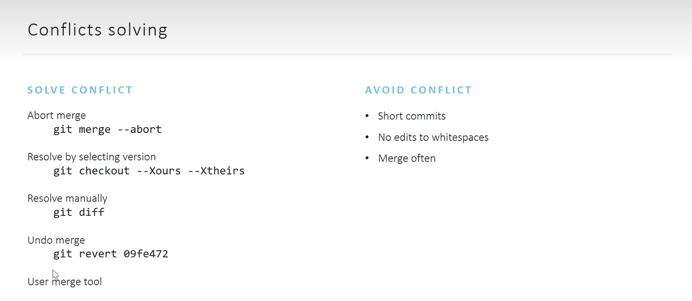

# git-demo - Repository to learn github commands

#### Git Setup
1) You can download [git here](http://git-scm.com/downloads)
2) Install Git with default settings.

***Generating a pair of ssh keys:***
1) open Git Bash and run script `ssh-keygen -t rsa –C “mail@test.com"` where 'mail@test.com' it is your github email
2) ssh-keys will generated and savad in folder `C:/Users/User_Name/.ssh` where `id_rsa.pub` it is public key that you should use in github  profile settings
The public key (id_rsa) should be sent to the owner of the repository in order to obtain work rights. Or upload to profile settings in bitbucket / github / gitlab.

***Username and email settings:***
1) add git config username: `git config --global user.name “FirstName SecondName“`
2) add git config email: `git config --global user.email “mail@test.com"`

#### Clone GitHub repository to local machine
1) open Git Bash in folder where you want to copy repository
2) run command:  `git clone git@github.com:gudzsv/git-demo.git` where `git@github.com:gudzsv/git-demo.git` - it is **SSH** link to repository you want to clone
#### How to Add changes from local machine to GitHub
1) check if you have changed files on local machine:  `git status`
2) add all changed files: `git add .` or if you have to add one file: `git add filename.txt`
3) add files to commit, you should use this command: `git commit -m "coment here"`
4) check commit logs: `git log`
5) send changed data from local machine to GitHub: `git push`
#### Get changed files fom GitHub to local machine
- to get changed data from G 	itHub to local machine: `git pull`
#### Open Git GUI (User Interface)
- run in Git Bash command `git gui&`
#### Open Git history commits in GUI
- run in Git Bash command `gitk&`
#### View all branches in repository
- run in Git Bash command  `git branch --all`
## Undoing changes

**Working directory (before you apply `git add .`)**
- `git checkout -- README.md` - this command undoing all changes in file `README.md`
-  `git checkout .` - this command undoing all changes in all files
-  `git clean -xdf ` - this command delete all files that were not previously committed

**Staging area (after `git add .`)**
- `git reset -- README.md` - this command return file to stage before `git add .`

**Local branch (afrer `git commit -m "commit here"`)**
- `git reset HEAD~1` - this command remove last commit **HEAD~(1)** -it is last commit if you want remove **2** last commit you should use `git reset HEAD~2`
- `git commit --amend -m "commit message"` - allow us add additional commit to previous commit, you may also do this via `git gui&`

**Remot repository**
- `git revert <sha1>`

## Git reset

- `git reset --soft HEAD~1` - reset last one commit and return to after `git add .` stage
- `git reset --mixed HEAD~1` - reset last one commit and return to before `git add .` stage
- `git reset --hard HEAD~1` - remove totally last one commit

## Git revert
- `git revert f9548162385cad4b34a65d6552baafe274519598` - removed commit this is `f9548162385cad4b34a65d6552baafe274519598` commit id

## Branching and merge
- **Branch concept**

- **Fast forward merge**

*Creating Branch*
- `git checkout -b branchName`
after changes in project you perform steps as before
1. `git add .`
2. `git commit -m "save changes in branch"`
3. `git checkout main` - change branch to main
4. `git marge branchName` - merge feature from branch "branchName"

- **Non Fast forward merge**

**Example**
- main branch make changes
  1. `git add .`
  2. `git commit -m "added commit in main branch"`
- change branch to "branchName" and make changes
  1. `git checkout branchName`
  2. `git add .`
  3. `git commit -m "added commit in "branchName" branch"`
- change branch from "branchName" to main branch
  1. `git checkout main`
  2. `git marge branchName`

## Conflict Solving

## Rebace
- created branch
- added new features to branch with 2 commits

- added 2 commits to main branch

- rebase main branch to new branch base changed from C to E commit in separate branch

- Golden rule

## Cherry-pick

## Tags (short text marker)

**Tags commands:**
- mark commit with tag `git tag var1`
- view tags `git tag -list`
- push `git push --tags`
- check it out `git checkout ver1`

## Stashing (spacial storage)

- save working directory `git stash save "description"`
- view stashes `git stash view`
- bring them back
  1. `git stash pop` (and remote from stash)
  2. `git stash apply` (leave in stash)
- remove `git stash drop` (clear)
